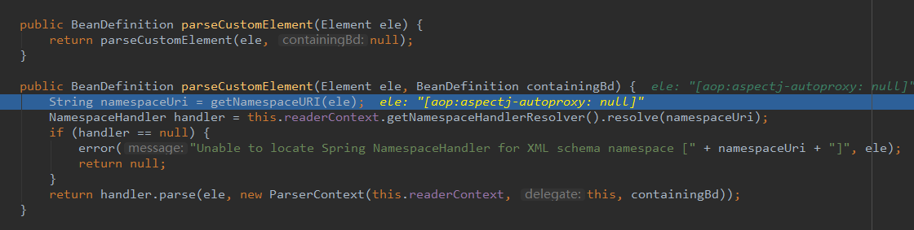
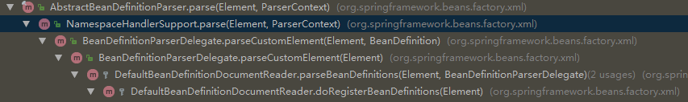

# Sundries
****
**SpringConfig.xml解析，当遇到自定义标签会从表头获取解析类，根据相关格式进行解析**

**BeanDefinitionParserDelegate**


```java
   public class NamespaceHandler extends NamespaceHandlerSupport {
	 @Override
	 public void init() {
		 // 注册解析器
		 registerBeanDefinitionParser(ElementNames.RAMCACHE, new CustomParser());
	 }
   }
```
**解析流程**
   
   
```java
      CustomElement extends AbstractBeanDefinitionParser{
        @Override
        protected AbstractBeanDefinition parseInternal(Element element, ParserContext parserContext) {
        }
      }
```
